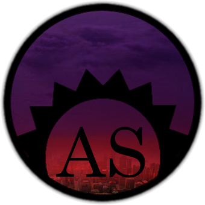

# [View It On Github Pages](https://thegamingden.github.io/after-sundown/)

# After Sundown

_"I hope you like nightmare worlds!"_

After Sundown is a cooperative storytelling game that tells stories in the realm
of horror. Players take on the roles of monsters out of horror movies or the
humans who oppose them, while one of the players takes on the role of the MC - a
combination referee, narrator, and roleplayer of last resort for antagonists and
minor characters in the story.

Cooperative storytelling can be done without any products at all, as with
collaborative writing or **Cops and Robbers**. After Sundown provides structure
and conflict resolution in the form of an established world and story, as well
as with a set of mechanics to determine the results of actions with the help of
six sided dice. In this way, players of After Sundown can bypass many of the
hangups of both collaborative fiction and Cops and Robbers: most notably the "I
shot you/ No you did not" problem. It is hoped that the backstory and
established characters of After Sundown will be sufficiently evocative as to
give players of protagonists and MCs ample launching points for stories of their
own.

The materials in this book are Public Domain \([CC0](LICENSE.txt)\). You can
print copies, trade electronic copies with friends, modify the files, or produce
derivative work.

* The game was first published on [The Gaming
  Den](http://tgdmb.com/viewtopic.php?t=52316) by Frank Trollman.
* After that, there were at least three people that made a PDF of the game.
* However, these days people have a lot of different sized screens among their
  PCs, Tablets, Phones, whatever, so a format that allows for easy mobile
  display is very desirable, and that's why we're here.

This version of the rules contains various small changes compared to the
original forum post that's still sitting on the gaming den (but never updated).
Only small fixes and relatively minor additions have been made. It's not at all
an AS 2e, more like "AS 1e + errata" sort of thing. It's the latest and greatest
version of After Sundown 1e.
